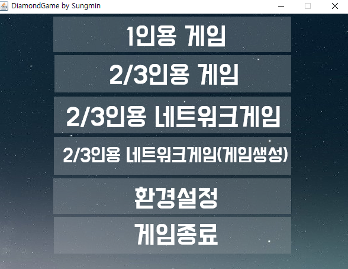
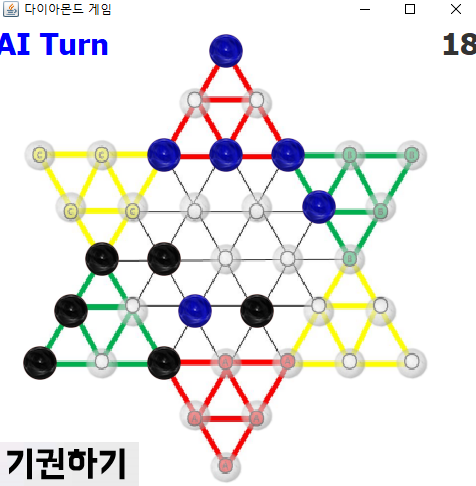
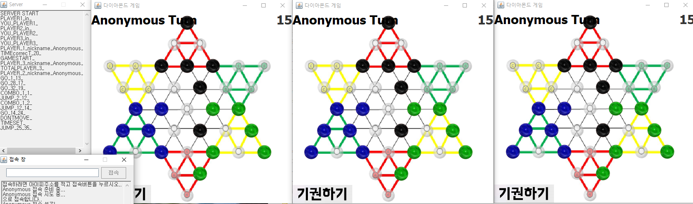

# Diamond game AI(chinese checker AI)
 2019 자바 프로그래밍 과제 : 다이아몬드게임(1인-ai, 2인,3인, 네트워크 게임)

### 메인

 

### AI모드
  * AI가 가지고 있는 돌 중(목적지에 다다르지 않은) 목적지에 점프를 통해 갈 수 있는 경로를 모두 저장하고, 그 경로중에 최고의 경로를 찾아 움직인다.
 
  
 
### 네트워크게임
  * TCP/IP 소켓 통신으로 구현하였다.

  
